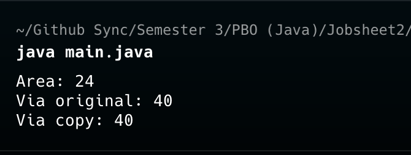
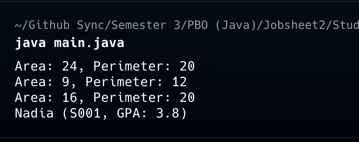
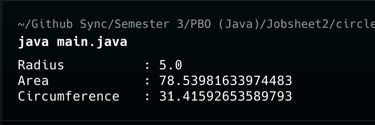

# LAPORAN PRAKTIKUM
Nama    : Ibni Andarta 
Kelas   : TI-2G 
## PEMROGRAMAN BERORIENTASI OBJEK
**Jobsheet Praktikum: Pertemuan 2**
---
### Rectangle output

 

### Student output

### Circle (Tugas)

 

(a) apa bedanya objek dengan referensi ke
objek?   -> Objek adalah entitas data nyata hasil instansiasi suatu kelas yang tersimpan di memori heap, memuat status nilai atribut dan perilaku (method) yang sesungguhnya. Sebaliknya, referensi ke objek hanyalah variabel penunjuk (biasanya di memori stack) yang menyimpan alamat memori ke objek tersebut, bukan data fisiknya.
  
(b) tepatnya kapan konstruktor sebuah kelas dijalankan?
  -> Konstruktor dijalankan tepat saat proses instansiasi berlangsung melalui pemanggilan kata kunci new.

