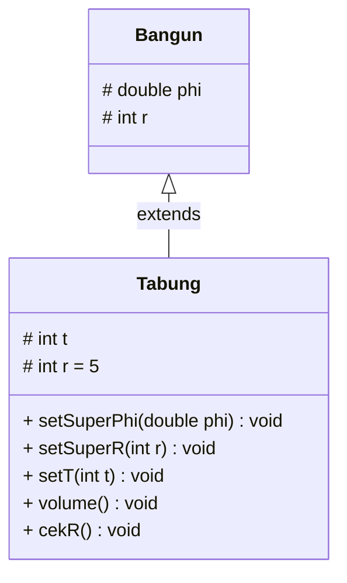
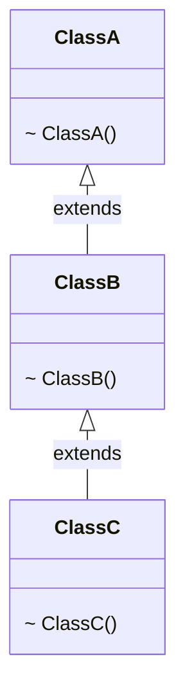
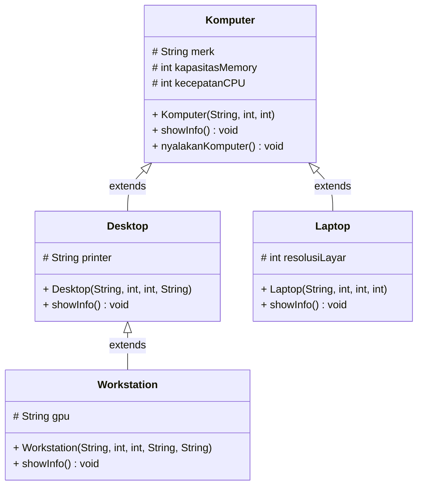
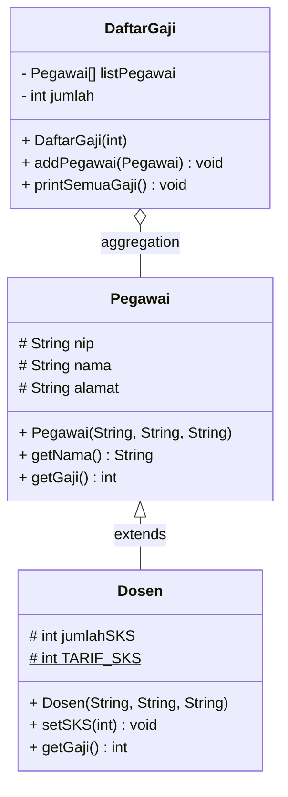
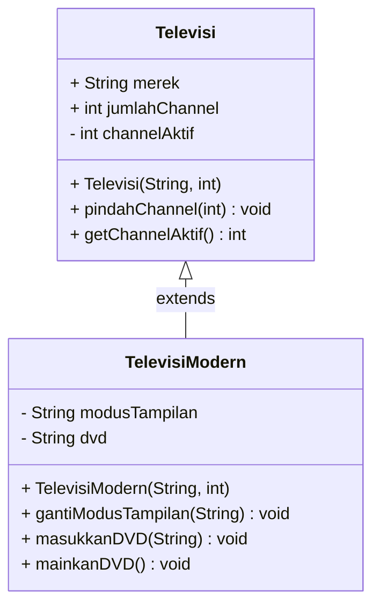
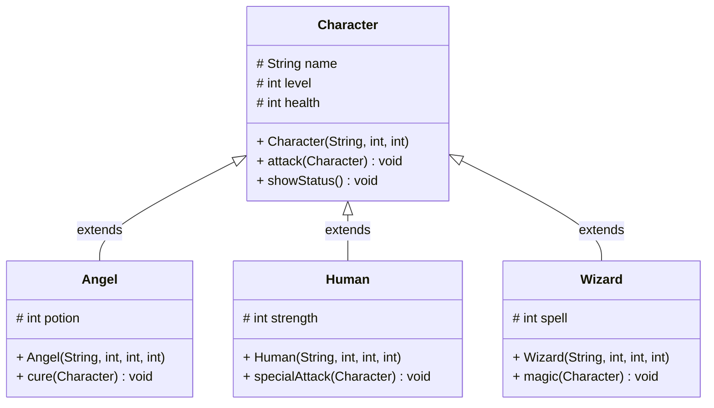

# LAPORAN PRAKTIKUM PEMROGRAMAN BERBASIS OBJEK
## Pertemuan 6: Inheritance (Pewarisan)

---

### Identitas Mahasiswa
- **Nama** : Ibni Andarta
- **Kelas** : TI-2G
- **NIM** : 254107020258
- **Mata Kuliah** : Praktikum Pemrograman Berbasis Objek (RTI253008)
- **Jurusan** : Teknologi Informasi - Politeknik Negeri Malang

---

## A. Ringkasan Materi & Teori

**Inheritance (Pewarisan)** merupakan salah satu pilar fundamental dalam Pemrograman Berorientasi Objek (*Object-Oriented Programming* / OOP) yang memungkinkan suatu kelas (*subclass / child class / derived class*) untuk mewarisi atribut dan method dari kelas lain yang lebih umum (*superclass / parent class / base class*).

### 1. Konsep Dasar & Hubungan *Is-A*
- Pewarisan merepresentasikan relasi semantik **is-a** (*adalah sebuah*). Contoh: `Desktop` *is-a* `Komputer`, `Dosen` *is-a* `Pegawai`.
- Menggunakan kata kunci `extends` pada deklarasi kelas Java:
  ```java
  public class SubClass extends SuperClass { ... }
  ```
- Subclass memperoleh kemampuan kode yang dapat digunakan kembali (*code reusability*) tanpa perlu mendefinisikan ulang kode milik superclass, serta dapat menambahkan atribut atau method baru yang spesifik.

### 2. Aturan Pewarisan di Java (*Single Inheritance*)
- Java **hanya mendukung *single inheritance*** untuk kelas, yang berarti satu kelas turunan hanya boleh memiliki **tepat satu superclass langsung**.
- Pola pewarisan bertingkat (*multilevel inheritance*) diperbolehkan (misal: `ClassC extends ClassB`, dan `ClassB extends ClassA`).
- Pewarisan hierarkis (*hierarchical inheritance*) juga diperbolehkan (satu superclass diturunkan ke beberapa subclass berbeda, seperti `Desktop extends Komputer` dan `Laptop extends Komputer`).

### 3. Matriks Kontrol Hak Akses (*Access Modifiers*)
Tidak semua member superclass dapat diakses langsung oleh subclass. Hak akses diatur oleh 4 tingkatan modifier:

| Modifier | Class yang sama | Package yang sama | Subclass (beda package) | Class mana pun |
| :--- | :---: | :---: | :---: | :---: |
| **`private`** | ✓ | | | |
| **`default`** (tanpa modifier) | ✓ | ✓ | | |
| **`protected`** | ✓ | ✓ | ✓ | |
| **`public`** | ✓ | ✓ | ✓ | ✓ |

- Member `private` **tidak pernah diwariskan** secara langsung kepada subclass. Untuk mengaksesnya, superclass harus menyediakan accessor/mutator publik (`getter`/`setter`).
- Member `protected` dirancang khusus agar dapat diakses oleh subclass (bahkan jika subclass berada di package yang berbeda).

### 4. Kata Kunci `super` dan `this`
- `this`: Merujuk pada instance/member dari kelas itu sendiri. Digunakan untuk merujuk atribut lokal, membedakan variabel lokal/parameter dengan variabel instans (*variable shadowing*), atau memanggil konstruktor lain dalam kelas yang sama (`this(...)`).
- `super`: Merujuk pada instance/member milik **superclass langsung**. Digunakan untuk:
  1. Mengakses atribut superclass yang tersembunyi (*shadowed field*): `super.namaAtribut`.
  2. Memanggil method superclass yang ditimpa (*overridden method*): `super.namaMethod()`.
  3. Memanggil konstruktor superclass: `super(...)`.

### 5. Konstruktor dan *Constructor Chaining*
- Konstruktor **tidak pernah diwariskan** ke subclass.
- Ketika objek subclass dibuat, konstruktor superclass **selalu dijalankan terlebih dahulu** sebelum konstruktor subclass dieksekusi.
- Pemanggilan `super(...)` **wajib menjadi pernyataan pertama (*first statement*)** di dalam tubuh konstruktor subclass.
- Jika subclass tidak memanggil `super(...)` secara eksplisit, compiler Java otomatis menyisipkan `super()` tanpa argumen (konstruktor default). Jika superclass hanya memiliki konstruktor berparameter, subclass wajib memanggil `super(...)` dengan argumen yang cocok secara eksplisit.

### 6. *Method Overriding* dan Anotasi `@Override`
- **Method Overriding**: Kemampuan subclass untuk menulis ulang implementasi method yang diwarisi dari superclass dengan nama, daftar parameter (*signature*), dan tipe kembalian yang sama persis.
- Anotasi `@Override`: Memerintahkan compiler untuk memeriksa keabsahan overriding. Jika terdapat salah ketik (*typo*) nama method atau ketidakcocokan tipe parameter, compiler akan langsung mengeluarkan peringatan error (*early error detection*).

---

## B. Percobaan 1: Single Inheritance dengan `extends` (ClassA dan ClassB)

### 1. Deskripsi Singkat
Mengimplementasikan pewarisan tunggal (*single inheritance*) sederhana antara `ClassA` (sebagai superclass yang memiliki atribut `public int x, y` dan method `getNilai()`) dan `ClassB` (sebagai subclass yang menambahkan atribut `public int z`, method `getNilaiZ()`, dan method `getJumlah()`).

### 2. Kode Program

- **`ClassA.java`** (`package percobaan1`)
```java
package percobaan1;

public class ClassA {
    public int x;
    public int y;

    public void getNilai() {
        System.out.println("nilai x: " + x);
        System.out.println("nilai y: " + y);
    }
}
```

- **`ClassB.java`** (`package percobaan1`)
```java
package percobaan1;

public class ClassB extends ClassA {
    public int z;

    public void getNilaiZ() {
        System.out.println("nilai z: " + z);
    }

    public void getJumlah() {
        System.out.println("jumlah: " + (x + y + z));
    }
}
```

- **`MainPercobaan1.java`** (`package percobaan1`)
```java
package percobaan1;

public class MainPercobaan1 {
    public static void main(String[] args) {
        ClassB hitung = new ClassB();
        hitung.x = 20;
        hitung.y = 30;
        hitung.z = 5;
        hitung.getNilai();
        hitung.getNilaiZ();
        hitung.getJumlah();
    }
}
```

### 3. Output Eksekusi
```text
nilai x: 20
nilai y: 30
nilai z: 5
jumlah: 55
```

### 4. Jawaban Pertanyaan Percobaan 1

1. **Mengapa kompilasi pada Langkah 5 gagal? Tuliskan pesan error pertama beserta file dan baris tempat error muncul.**  
   **Jawab:**  
   Kompilasi gagal karena pada Langkah 3, kelas `ClassB` belum dideklarasikan dengan klausa `extends ClassA`. Tanpa pewarisan, variabel `x` dan `y` tidak dikenali di dalam `ClassB`. Selain itu, pada `MainPercobaan1`, objek `hitung` bertipe `ClassB` tidak memiliki atribut `x`, `y`, maupun method `getNilai()`.  
   Pesan error pertama yang muncul:
   ```text
   percobaan1/ClassB.java:11: error: cannot find symbol
           System.out.println("jumlah: " + (x + y + z));
                                            ^
     symbol:   variable x
     location: class ClassB
   ```

2. **Baris kode mana yang diubah pada Langkah 6, dan apa artinya? Sebutkan class yang berperan sebagai superclass dan subclass.**  
   **Jawab:**  
   - Baris yang diubah pada `ClassB.java` baris deklarasi kelas:
     ```java
     public class ClassB extends ClassA
     ```
   - Artinya: Kelas `ClassB` secara resmi dijadikan sebagai turunan dari `ClassA`, sehingga mewarisi seluruh member (atribut dan method) non-private milik `ClassA`.
   - **Superclass**: `ClassA`
   - **Subclass**: `ClassB`

3. **Setelah diperbaiki, sebutkan atribut dan method yang dapat dipakai oleh objek `hitung`. Kelompokkan mana yang dideklarasikan di `ClassA` dan mana yang dideklarasikan di `ClassB`.**  
   **Jawab:**  
   - **Dideklarasikan di `ClassA` (diwariskan ke `ClassB`)**:
     - Atribut: `public int x`, `public int y`
     - Method: `public void getNilai()`
   - **Dideklarasikan di `ClassB` (member spesifik `ClassB`)**:
     - Atribut: `public int z`
     - Method: `public void getNilaiZ()`, `public void getJumlah()`
   - *(Catatan: Objek juga mewarisi method bawaan dari superclass dasar Java `java.lang.Object` seperti `toString()`, `equals()`, `hashCode()`, dll).*

4. **Pada `MainPercobaan1`, `hitung.x = 20` ditulis pada objek `ClassB`, padahal atribut `x` tidak dideklarasikan di `ClassB`. Mengapa hal ini diperbolehkan?**  
   **Jawab:**  
   Hal ini diperbolehkan karena mekanisme pewarisan (*inheritance*). Ketika `ClassB` mewarisi `ClassA` via kata kunci `extends`, seluruh atribut berkategori `public` milik `ClassA` otomatis menjadi bagian dari member `ClassB`. Objek `hitung` yang diinstansiasi dari `ClassB` memiliki memori untuk menampung variabel `x`, sehingga dapat diakses secara langsung.

5. **Atribut `x` dan `y` pada `ClassA` dibuat `public`, sehingga dapat diubah langsung dari `MainPercobaan1`. Apa risiko dari desain seperti ini? (jawaban ini akan kita telusuri pada Percobaan 2)**  
   **Jawab:**  
   Risiko desain atribut `public` adalah:
   - **Melanggar prinsip enkapsulasi (*leaky abstraction*)**: Nilai atribut dapat diubah secara bebas oleh kelas luar tanpa mekanisme kontrol atau validasi (misalnya diisi angka negatif atau nilai tidak masuk akal).
   - **Ketergantungan ketat (*tight coupling*)**: Apabila tipe data atau representasi internal dari `x` atau `y` di masa depan diubah, maka seluruh kode pemanggil di kelas luar yang mengakses atribut secara langsung akan mengalami kerusakan (*breaking changes*).

6. **Coba tambahkan class `ClassD` lalu ubah deklarasi menjadi `public class ClassB extends ClassA, ClassD`. Apa yang terjadi? Apa yang dapat Anda simpulkan tentang jumlah superclass langsung pada Java?**  
   **Jawab:**  
   - Yang terjadi: Muncul kesalahan kompilasi (*compile error*): `error: '{' expected` pada tanda koma `,`.
   - Kesimpulan: Bahasa pemrograman Java **TIDAK MENDUKUNG pewarisan ganda (*multiple inheritance of classes*)**. Sebuah class di Java hanya diizinkan memiliki **satu superclass langsung** (*single inheritance*). Hal ini dirancang untuk mencegah ambiguitas (*Diamond Problem*). Jika membutuhkan banyak turunan kontrak perilaku, Java menggunakan mekanisme `interface` (`implements`).

---

## C. Percobaan 2: Hak Akses pada Pewarisan (`private` dan `protected`)

### 1. Deskripsi Singkat
Percobaan ini mendemonstrasikan batasan hak akses `private` pada relasi pewarisan. Atribut `private` pada superclass tidak dapat diakses langsung oleh subclass. Kemudian dilakukan dua pendekatan solusi perbaikan:
1. **Perbaikan A**: Mengubah modifier atribut superclass menjadi `protected`.
2. **Perbaikan B (Best Practice)**: Mempertahankan atribut tetap `private`, lalu menyediakan method *getter/setter* publik di superclass dan memanggil *getter* tersebut dari subclass.

### 2. Kode Program (Implementasi Perbaikan B - Strict Encapsulation)

- **`ClassA.java`** (`package percobaan2`)
```java
package percobaan2;

public class ClassA {
    private int x;
    private int y;

    public void setX(int x) {
        this.x = x;
    }

    public void setY(int y) {
        this.y = y;
    }

    public void getNilai() {
        System.out.println("nilai x: " + x);
        System.out.println("nilai y: " + y);
    }

    public int getX() {
        return x;
    }

    public int getY() {
        return y;
    }
}
```

- **`ClassB.java`** (`package percobaan2`)
```java
package percobaan2;

public class ClassB extends ClassA {
    private int z;

    public void setZ(int z) {
        this.z = z;
    }

    public void getNilaiZ() {
        System.out.println("nilai z: " + z);
    }

    public void getJumlah() {
        System.out.println("jumlah: " + (getX() + getY() + z));
    }
}
```

- **`MainPercobaan2.java`** (`package percobaan2`)
```java
package percobaan2;

public class MainPercobaan2 {
    public static void main(String[] args) {
        ClassB hitung = new ClassB();
        hitung.setX(20);
        hitung.setY(30);
        hitung.setZ(5);
        hitung.getNilai();
        hitung.getNilaiZ();
        hitung.getJumlah();
    }
}
```

### 3. Output Eksekusi
```text
nilai x: 20
nilai y: 30
nilai z: 5
jumlah: 55
```

### 4. Jawaban Pertanyaan Percobaan 2

1. **Di file dan baris mana error pada Langkah 5 muncul, dan apa pesannya? Mengapa error tidak muncul di `MainPercobaan2`?**  
   **Jawab:**  
   - Error muncul di file **`ClassB.java` baris 15** pada method `getJumlah()`:
     ```text
     percobaan2/ClassB.java:15: error: x has private access in ClassA
             System.out.println("jumlah: " + (x + y + z));
                                              ^
     percobaan2/ClassB.java:15: error: y has private access in ClassA
             System.out.println("jumlah: " + (x + y + z));
                                                  ^
     ```
   - Alasan error tidak muncul di `MainPercobaan2`: Karena kelas `MainPercobaan2` hanya memanggil method-method bertipe `public` (`hitung.setX(20)`, `hitung.setY(30)`, dll). Yang melanggar hak akses adalah baris 15 di dalam method `getJumlah()` pada `ClassB` yang mencoba membaca variabel `x` dan `y` bertipe `private` secara langsung.

2. **Jelaskan penyebab error tersebut dengan merujuk pada tabel kontrol pengaksesan (Langkah 1).**  
   **Jawab:**  
   Berdasarkan tabel kontrol hak akses, modifier `private` hanya mengizinkan pengaksesan dari dalam **Class yang sama** tempat member dideklarasikan (`ClassA`). Pada kolom *Subclass*, tanda centang untuk `private` **tidak ada**. Artinya, status pewarisan tidak memberikan izin kepada subclass (`ClassB`) untuk mengakses atribut `private` superclass secara langsung.

3. **Pada kode awal, `MainPercobaan2` memanggil `hitung.setX(20)` dan tidak error, padahal `x` bersifat `private`. Mengapa pemanggilan ini diperbolehkan, dan di mana nilai `x` tersimpan?**  
   **Jawab:**  
   - Pemanggilan tersebut diperbolehkan karena method `setX(int x)` dideklarasikan dengan modifier `public` di `ClassA`. Sebagai subclass, `ClassB` mewarisi method `public` tersebut. Ketika method `setX(20)` dieksekusi, manipulasi terhadap atribut `x` dilakukan di dalam tubuh kelas `ClassA` sendiri (`this.x = x;`), sehingga sah menurut aturan hak akses.
   - Nilai `x` tersimpan di dalam objek `hitung` pada memori *heap*. Saat sebuah objek `ClassB` diinstansiasi, memori yang dialokasikan mencakup seluruh state yang didefinisikan oleh superclass (`ClassA`) beserta subclass (`ClassB`).

4. **Bandingkan Perbaikan A (`protected`) dan Perbaikan B (`private` + getter) dari sisi *encapsulation*. Mana yang Anda pilih untuk program sungguhan? Jelaskan alasannya.**  
   **Jawab:**  
   - **Perbandingan**:
     - **Perbaikan A (`protected`)**: Memberikan akses langsung kepada subclass dan seluruh kelas dalam package yang sama. Enkapsulasinya lebih longgar (*leaky*) karena subclass dapat memanipulasi nilai secara sembarangan tanpa validasi.
     - **Perbaikan B (`private` + getter/setter)**: Menerapkan prinsip enkapsulasi murni (*strict encapsulation*). State internal superclass terlindungi sepenuhnya. Subclass hanya dapat mengakses data melalui kontrak method terkelola.
   - **Pilihan untuk program sungguhan**: **Perbaikan B (`private` + getter/setter)**.
   - **Alasan**: Menjaga integritas data (*data integrity*), memudahkan pemeliharaan kode (*maintainability*), dan memungkinkan penyisipan logika validasi atau formatting di masa mendatang tanpa perlu mengubah kode pada kelas turunan.

5. **Andaikan `ClassA` dan `ClassB` berada di package yang berbeda. Berdasarkan tabel, apakah `ClassB` tetap dapat mengakses atribut `protected` milik `ClassA`? Bagaimana jika atributnya `default` (tanpa modifier)?**  
   **Jawab:**  
   - Atribut **`protected`**: **YA, TETAP DAPAT DIAKSES**. Sesuai tabel kolom *Subclass (beda package)*, modifier `protected` memiliki tanda centang (`✓`). Tujuan utama modifier `protected` adalah memberikan hak akses khusus kepada kelas turunan di mana pun letak package-nya.
   - Atribut **`default` (tanpa modifier)**: **TIDAK DAPAT DIAKSES**. Kolom *Subclass (beda package)* untuk default bernilai kosong. Akses `default` hanya berlaku untuk kelas-kelas yang berada di dalam satu package yang sama (*package-private*).

---

## D. Percobaan 3: Kata Kunci `this` dan `super` (Bangun dan Tabung)

### 1. Deskripsi Singkat
Percobaan ini mengeksplorasi penggunaan kata kunci `this` untuk merujuk pada kelas saat ini dan kata kunci `super` untuk merujuk pada superclass. Studi kasus menggunakan kelas `Bangun` (memiliki atribut `phi` dan `r` bertipe `protected`) dan kelas `Tabung` yang menghitung volume, serta mendemonstrasikan konsep *attribute shadowing* (ketika subclass mendeklarasikan atribut dengan nama yang sama dengan superclass).

### 2. Diagram Kelas



### 3. Kode Program

- **`Bangun.java`** (`package percobaan3`)
```java
package percobaan3;

public class Bangun {
    protected double phi;
    protected int r;
}
```

- **`Tabung.java`** (`package percobaan3`)
```java
package percobaan3;

public class Tabung extends Bangun {
    protected int t;
    protected int r = 5;

    public void setSuperPhi(double phi) {
        super.phi = phi;
    }

    public void setSuperR(int r) {
        super.r = r;
    }

    public void setT(int t) {
        this.t = t;
    }

    public void volume() {
        System.out.println("Volume Tabung adalah: "
                + (super.phi * super.r * super.r * this.t));
    }

    public void cekR() {
        System.out.println("r = " + r);
        System.out.println("this.r = " + this.r);
        System.out.println("super.r = " + super.r);
    }
}
```

- **`MainPercobaan3.java`** (`package percobaan3`)
```java
package percobaan3;

public class MainPercobaan3 {
    public static void main(String[] args) {
        Tabung tabung = new Tabung();
        tabung.setSuperPhi(3.14);
        tabung.setSuperR(10);
        tabung.setT(3);
        tabung.volume();
        tabung.cekR();
    }
}
```

### 4. Output Eksekusi
```text
Volume Tabung adalah: 942.0
r = 5
this.r = 5
super.r = 10
```

### 5. Jawaban Pertanyaan Percobaan 3

1. **Jelaskan fungsi `super` pada `super.phi = phi;` dan `super.r = r;` di method `setSuperPhi()` dan `setSuperR()` milik `Tabung`.**  
   **Jawab:**  
   Kata kunci `super` berfungsi untuk secara eksplisit menunjuk bahwa variabel target yang hendak diisi adalah atribut `phi` dan `r` yang dideklarasikan pada **superclass** (`Bangun`). Hal ini memastikan bahwa penugasan nilai tidak salah sasaran ke variabel lokal atau atribut kelas `Tabung` itu sendiri.

2. **Jelaskan fungsi `super` dan `this` pada ekspresi `super.phi * super.r * super.r * this.t` di method `volume()`.**  
   **Jawab:**  
   - `super.phi`: Mengambil nilai atribut konstanta $\pi$ milik superclass `Bangun` (bernilai 3.14).
   - `super.r`: Mengambil nilai atribut jari-jari lingkaran milik superclass `Bangun` (bernilai 10).
   - `this.t`: Mengambil nilai atribut tinggi silinder milik subclass `Tabung` (bernilai 3).
   - Kombinasi kata kunci ini memperjelas asal-usul sumber data dalam rumus matematika volume silinder: $V = \pi \times r^2 \times t$.

3. **Mengapa `Tabung` tidak mendeklarasikan atribut `phi` dan `r`, tetapi tetap dapat mengaksesnya? Apa yang terjadi bila pada `Bangun` keduanya diubah menjadi `private`?**  
   **Jawab:**  
   - `Tabung` dapat mengaksesnya karena `Tabung` mewarisi `Bangun` (`extends Bangun`) dan atribut `phi` serta `r` memiliki access modifier `protected`. Modifier `protected` memberikan hak akses langsung ke seluruh kelas turunan (*subclass*).
   - Jika pada `Bangun` keduanya diubah menjadi `private`, maka kompilasi akan **gagal (*compile error*)** dengan pesan bahwa `phi` dan `r` memiliki akses private di kelas `Bangun`. Subclass tidak diizinkan menyentuh langsung atribut bertipe `private`.

4. **Pada Eksperimen 1, apakah output berubah ketika `super.phi` diganti `this.phi`? Jelaskan mengapa.**  
   **Jawab:**  
   - **Output TIDAK BERUBAH** (hasil perhitungan volume tetap `942.0`).
   - Penjelasan: Pada kelas `Tabung` tidak dideklarasikan atribut bernama `phi`. Ketika dipanggil `this.phi`, Java akan memeriksa apakah kelas `Tabung` memiliki field `phi`; karena tidak ada, pencarian dilanjutkan naik ke hierarki pewarisan di atasnya (kelas `Bangun`). Karena ditemukan pada `Bangun`, maka `this.phi` mengacu ke variabel memori yang sama persis dengan `super.phi`.

5. **Pada Eksperimen 2, mengapa `r`, `this.r`, dan `super.r` menghasilkan nilai yang berbeda? Pada kondisi apa awalan `super.` menjadi wajib dipakai?**  
   **Jawab:**  
   - Penyebab perbedaan nilai: Terjadi peristiwa **Attribute Shadowing (Field Shadowing)** karena kelas `Tabung` mendeklarasikan atribut baru dengan nama yang sama persis dengan superclassnya, yaitu `protected int r = 5;`.
     - `r` dan `this.r`: Menunjuk pada atribut lokal milik `Tabung`, yaitu bernilai `5`.
     - `super.r`: Menunjuk pada atribut `r` milik superclass `Bangun`, yang sebelumnya telah diisi dengan nilai `10` lewat `setSuperR(10)`.
   - **Kondisi awalan `super.` menjadi wajib dipakai**: Awalan `super.` wajib digunakan ketika terjadi *shadowing* (nama atribut subclass menutupi atribut superclass) dan programmer ingin mengakses nilai asli dari superclass, atau ketika subclass meng-override method superclass dan ingin memanggil implementasi method aslinya.

---

## E. Percobaan 4: Konstruktor dan Multilevel Inheritance (ClassA, ClassB, ClassC)

### 1. Deskripsi Singkat
Percobaan ini mendemonstrasikan konsep pewarisan bertingkat (*multilevel inheritance*) menggunakan tiga kelas berjenjang (`ClassA` $\leftarrow$ `ClassB` $\leftarrow$ `ClassC`) dan membuktikan mekanisme *constructor chaining*, yaitu urutan eksekusi konstruktor superclass yang selalu dijalankan dari tingkat teratas hingga tingkat terbawah.

### 2. Diagram Kelas



### 3. Kode Program

- **`ClassA.java`** (`package percobaan4`)
```java
package percobaan4;

public class ClassA {
    ClassA() {
        System.out.println("konstruktor A dijalankan");
    }
}
```

- **`ClassB.java`** (`package percobaan4`)
```java
package percobaan4;

public class ClassB extends ClassA {
    ClassB() {
        System.out.println("konstruktor B dijalankan");
    }
}
```

- **`ClassC.java`** (`package percobaan4`)
```java
package percobaan4;

public class ClassC extends ClassB {
    ClassC() {
        super();
        System.out.println("konstruktor C dijalankan");
    }
}
```

- **`MainPercobaan4.java`** (`package percobaan4`)
```java
package percobaan4;

public class MainPercobaan4 {
    public static void main(String[] args) {
        ClassC test = new ClassC();
    }
}
```

### 4. Output Eksekusi
```text
konstruktor A dijalankan
konstruktor B dijalankan
konstruktor C dijalankan
```

### 5. Jawaban Pertanyaan Percobaan 4

1. **Sebutkan class yang berperan sebagai superclass dan subclass pada percobaan ini beserta alasannya. Mengapa `ClassB` disebut berperan ganda?**  
   **Jawab:**  
   - Relasi hierarki:
     - `ClassA` berperan sebagai **Superclass** dari `ClassB`.
     - `ClassB` berperan sebagai **Subclass** dari `ClassA`, sekaligus menjadi **Superclass** bagi `ClassC`.
     - `ClassC` berperan sebagai **Subclass** dari `ClassB`.
   - `ClassB` disebut **berperan ganda** karena dalam rantai pewarisan bertingkat (*multilevel inheritance*), ia berada di posisi tengah: mewarisi karakteristik dari kelas di atasnya (`ClassA`) dan menurunkan karakteristiknya ke kelas di bawahnya (`ClassC`).

2. **Program hanya membuat satu objek (`new ClassC()`), tetapi tiga baris tercetak. Jelaskan mengapa konstruktor `ClassA` dan `ClassB` ikut dijalankan.**  
   **Jawab:**  
   Karena di Java berlaku mekanisme **Constructor Chaining**. Konstruktor tidak diwariskan, namun sebuah objek turunan tidak dapat berdiri sendiri tanpa inisialisasi superclassnya terlebih dahulu. Ketika `new ClassC()` dipanggil, baris pertama konstruktornya memanggil konstruktor `ClassB()`, dan baris pertama `ClassB()` memanggil konstruktor `ClassA()`. Akibatnya, seluruh konstruktor pada hierarki pewarisan dieksekusi secara berurutan dari atas ke bawah.

3. **Pada Modifikasi 1, mengapa output tidak berbeda dari sebelumnya meskipun `super();` ditambahkan secara eksplisit?**  
   **Jawab:**  
   Karena jika sebuah konstruktor subclass tidak memanggil konstruktor superclass secara eksplisit, compiler Java secara otomatis (*by default*) akan menyisipkan pernyataan `super();` (pemanggilan konstruktor tanpa argumen milik parent) pada baris paling pertama. Menuliskan `super();` secara manual hanya mempertegas perilaku bawaan compiler tersebut.

4. **Pada Modifikasi 2 terjadi error. Aturan apa yang dilanggar, dan mengapa Java menetapkan aturan tersebut?**  
   **Jawab:**  
   - Pesan error: `call to super must be first statement in constructor`.
   - Aturan yang dilanggar: Pemanggilan konstruktor superclass (`super()`) **wajib menjadi pernyataan pertama (*first statement*)** di dalam tubuh konstruktor subclass.
   - Alasan Java menetapkan aturan tersebut: Untuk menjamin integritas objek (*state integrity*). Bagian fondasi objek yang didefinisikan oleh superclass harus siap dan terinisialisasi sempurna sebelum subclass mulai mengeksekusi kode logikanya atau memanipulasi atribut di dalamnya. Jika kode subclass berjalan lebih dulu, ada potensi bahaya mengakses member superclass yang belum siap.

5. **Tuliskan urutan proses (bernomor) yang terjadi ketika `new ClassC()` dieksekusi, dimulai dari pemanggilan konstruktor `ClassC` hingga seluruh output tercetak.**  
   **Jawab:**  
   1. Statement `new ClassC()` di `main` mulai dieksekusi; memori objek dialokasikan di *heap*.
   2. Eksekusi memasuki konstruktor `ClassC()`.
   3. Pada baris pertama `ClassC()`, dipanggil `super()` yang mengalihkan alur eksekusi ke konstruktor `ClassB()`.
   4. Pada baris pertama `ClassB()`, secara otomatis dipanggil `super()` implisit yang mengalihkan alur ke konstruktor `ClassA()`.
   5. Pada baris pertama `ClassA()`, dipanggil konstruktor `java.lang.Object()`.
   6. Konstruktor `Object` selesai, kontrol kembali ke tubuh konstruktor `ClassA()`.
   7. Pernyataan `System.out.println("konstruktor A dijalankan")` mencetak baris pertama: `konstruktor A dijalankan`.
   8. Konstruktor `ClassA()` selesai, kontrol kembali ke tubuh konstruktor `ClassB()`.
   9. Pernyataan `System.out.println("konstruktor B dijalankan")` mencetak baris kedua: `konstruktor B dijalankan`.
   10. Konstruktor `ClassB()` selesai, kontrol kembali ke tubuh konstruktor `ClassC()`.
   11. Pernyataan `System.out.println("konstruktor C dijalankan")` mencetak baris ketiga: `konstruktor C dijalankan`.
   12. Konstruktor `ClassC()` selesai, objek terbentuk sempurna dan referensinya disimpan pada variabel `test`.

---

## F. Percobaan 5: Konstruktor Berparameter dan Overriding (Komputer, Desktop, Laptop)

### 1. Deskripsi Singkat
Percobaan ini mendemonstrasikan:
1. Pemanggilan konstruktor superclass berparameter secara eksplisit menggunakan `super(arg1, arg2, ...)` dari konstruktor subclass.
2. Penerapan *method overriding* pada method `showInfo()` di subclass `Desktop` dan `Laptop`, yang memanfaatkan pemanggilan implementasi superclass via `super.showInfo()`.
3. Penyelesaian studi kasus tantangan pembuatan kelas `Workstation`.

### 2. Diagram Kelas



### 3. Kode Program

- **`Komputer.java`** (`package percobaan5`)
```java
package percobaan5;

public class Komputer {
    protected String merk;
    protected int kapasitasMemory;
    protected int kecepatanCPU;

    public Komputer(String merk, int memory, int cpu) {
        this.merk = merk;
        this.kapasitasMemory = memory;
        this.kecepatanCPU = cpu;
    }

    public void showInfo() {
        System.out.println("Merk : " + merk);
        System.out.println("Kapasitas Memory: " + kapasitasMemory + " MB");
        System.out.println("Kecepatan CPU : " + kecepatanCPU + " MHz");
    }

    public void nyalakanKomputer() {
        System.out.println("Komputer " + merk + " dinyalakan");
    }
}
```

- **`Desktop.java`** (`package percobaan5`)
```java
package percobaan5;

public class Desktop extends Komputer {
    protected String printer;

    public Desktop(String merk, int memory, int cpu, String printer) {
        super(merk, memory, cpu);
        this.printer = printer;
    }

    @Override
    public void showInfo() {
        super.showInfo();
        System.out.println("Printer : " + printer);
    }
}
```

- **`Laptop.java`** (`package percobaan5`)
```java
package percobaan5;

public class Laptop extends Komputer {
    protected int resolusiLayar;

    public Laptop(String merk, int memory, int cpu, int resolusi) {
        super(merk, memory, cpu);
        this.resolusiLayar = resolusi;
    }

    @Override
    public void showInfo() {
        super.showInfo();
        System.out.println("Resolusi Layar : " + resolusiLayar + "p");
    }
}
```

- **`Workstation.java`** (`package percobaan5`) *(Implementasi Tantangan No. 5)*
```java
package percobaan5;

public class Workstation extends Desktop {
    protected String gpu;

    public Workstation(String merk, int memory, int cpu, String printer, String gpu) {
        super(merk, memory, cpu, printer);
        this.gpu = gpu;
    }

    @Override
    public void showInfo() {
        super.showInfo();
        System.out.println("GPU : " + gpu);
    }
}
```

- **`MainPercobaan5.java`** (`package percobaan5`)
```java
package percobaan5;

public class MainPercobaan5 {
    public static void main(String[] args) {
        Desktop desk = new Desktop("Dell", 2048, 3500, "Canon");
        Laptop lap = new Laptop("Asus", 4096, 2500, 720);

        desk.showInfo();
        System.out.println();
        lap.showInfo();
        System.out.println();
        desk.nyalakanKomputer();
    }
}
```

### 4. Output Eksekusi
```text
Merk : Dell
Kapasitas Memory: 2048 MB
Kecepatan CPU : 3500 MHz
Printer : Canon

Merk : Asus
Kapasitas Memory: 4096 MB
Kecepatan CPU : 2500 MHz
Resolusi Layar : 720p

Komputer Dell dinyalakan
```

### 5. Jawaban Pertanyaan Percobaan 5

1. **Jelaskan fungsi `super(merk, memory, cpu)` pada konstruktor `Desktop`. Atribut apa saja yang diisi oleh baris tersebut, dan atribut apa yang diisi oleh baris berikutnya?**  
   **Jawab:**  
   - Fungsi: Memanggil konstruktor milik superclass (`Komputer`) untuk menginisialisasi atribut-atribut dasar komputer pada saat objek `Desktop` dibuat.
   - Atribut yang diisi oleh baris `super(merk, memory, cpu)`:
     - `this.merk` (atribut superclass `Komputer`)
     - `this.kapasitasMemory` (atribut superclass `Komputer`)
     - `this.kecepatanCPU` (atribut superclass `Komputer`)
   - Atribut yang diisi oleh baris berikutnya (`this.printer = printer;`): Atribut `printer` (atribut spesifik milik `Desktop`).

2. **Pada Eksperimen 1, mengapa error muncul di sini, padahal pada Percobaan 4 `super()` juga tidak ditulis tetapi program tetap berjalan?**  
   **Jawab:**  
   Karena pada Percobaan 4, superclass menyediakan konstruktor default tanpa parameter sehingga pemanggilan otomatis `super();` oleh compiler berhasil.  
   Sebaliknya pada Percobaan 5, kelas `Komputer` **hanya memiliki konstruktor berparameter** (`Komputer(String, int, int)`) dan **tidak memiliki konstruktor default tanpa parameter** (karena begitu kita mendefinisikan konstruktor kustom, Java tidak lagi menyediakan konstruktor default otomatis). Ketika pemanggilan `super(...)` dihapus, compiler menyisipkan `super();` otomatis tanpa argumen, yang tidak ditemukan pada kelas `Komputer`, menghasilkan error: `constructor Komputer in class Komputer cannot be applied to given types; required: String,int,int; found: no arguments`.

3. **Method `showInfo()` ditulis di `Komputer` sekaligus di `Desktop`. Apa istilah untuk kondisi ini? Apa yang tercetak bila baris `super.showInfo();` pada `Desktop` dihapus?**  
   **Jawab:**  
   - Istilah: **Method Overriding** (penimpaan method). Subclass mendefinisikan ulang method warisan superclass dengan nama, parameter, dan return type yang identik.
   - Jika `super.showInfo();` pada `Desktop` dihapus: Informasi dasar (Merk, Kapasitas Memory, Kecepatan CPU) tidak akan dicetak. Yang tercetak hanya baris:
     ```text
     Printer : Canon
     ```

4. **Pada Eksperimen 2, jelaskan perbedaan hasil kompilasi dengan dan tanpa `@Override`. Apa manfaat menuliskan `@Override`?**  
   **Jawab:**  
   - **Dengan `@Override`**: Ketika nama method salah ketik menjadi `showinfo()` (huruf 'i' kecil), compiler mendeteksi ketidakcocokan nama dan langsung membatalkan kompilasi (*compile error*): `method does not override or implement a method from a supertype`.
   - **Tanpa `@Override`**: Kompilasi akan lolos (*success*), namun Java menganggap `showinfo()` sebagai method baru biasa, bukan penimpa method `showInfo()`. Akibatnya, saat `desk.showInfo()` dipanggil, yang berjalan adalah versi asli milik `Komputer` sehingga baris printer tidak tercetak (terjadi kesalahan logika (*bug*)).
   - **Manfaat menuliskan `@Override`**: Memberikan validasi otomatis saat kompilasi (*compile-time safety*) untuk memastikan bahwa method benar-benar menimpa method superclass, serta meningkatkan keterbacaan kode (*code readability*).

5. **Tantangan. Buat class `Workstation` sebagai turunan `Desktop` dengan atribut `gpu` (String). Class ini harus menimpa `showInfo()` sehingga menampilkan seluruh informasi Desktop ditambah baris GPU. Ketika `new Workstation(...)` dibuat, konstruktor class apa saja yang terpanggil, dan dalam urutan apa?**  
   **Jawab:**  
   - Kode telah dibuat pada file `Workstation.java`.
   - Urutan konstruktor yang terpanggil saat objek `new Workstation(...)` dibuat:
     1. **Konstruktor `Komputer(...)`** (Superclass tingkat atas / kakek)
     2. **Konstruktor `Desktop(...)`** (Superclass langsung / induk)
     3. **Konstruktor `Workstation(...)`** (Subclass / anak)

---

## G. Tugas Mandiri 1: Pegawai, Dosen, dan DaftarGaji

### 1. Deskripsi Singkat & Aturan Bisnis
Studi kasus ini menggabungkan konsep **Inheritance** (Dosen adalah seorang Pegawai) dan **Aggregation** (DaftarGaji memiliki kumpulan Pegawai):
- Kelas `Pegawai` memiliki atribut `nip`, `nama`, `alamat`, serta method `getGaji()` yang mengembalikan gaji pokok tetap **Rp1.500.000**.
- Kelas `Dosen` mewarisi `Pegawai`, memiliki atribut tambahan `jumlahSKS` dan konstanta `TARIF_SKS = 100000`. Method `getGaji()` di-override untuk mengembalikan gaji pokok Pegawai ditambah `jumlahSKS * TARIF_SKS` dengan memanfaatkan `super.getGaji()`.
- Kelas `DaftarGaji` menyimpan objek `Pegawai` dalam array agregasi (`Pegawai[]`) dan memiliki method `printSemuaGaji()`.

### 2. Diagram Kelas



### 3. Kode Program

- **`Pegawai.java`** (`package tugas1`)
```java
package tugas1;

public class Pegawai {
    protected String nip;
    protected String nama;
    protected String alamat;

    public Pegawai(String nip, String nama, String alamat) {
        this.nip = nip;
        this.nama = nama;
        this.alamat = alamat;
    }

    public String getNama() {
        return nama;
    }

    public int getGaji() {
        return 1500000;
    }
}
```

- **`Dosen.java`** (`package tugas1`)
```java
package tugas1;

public class Dosen extends Pegawai {
    protected int jumlahSKS;
    protected static final int TARIF_SKS = 100000;

    public Dosen(String nip, String nama, String alamat) {
        super(nip, nama, alamat);
    }

    public void setSKS(int jumlahSKS) {
        this.jumlahSKS = jumlahSKS;
    }

    @Override
    public int getGaji() {
        return super.getGaji() + (jumlahSKS * TARIF_SKS);
    }
}
```

- **`DaftarGaji.java`** (`package tugas1`)
```java
package tugas1;

public class DaftarGaji {
    private Pegawai[] listPegawai;
    private int jumlah;

    public DaftarGaji(int kapasitas) {
        this.listPegawai = new Pegawai[kapasitas];
        this.jumlah = 0;
    }

    public void addPegawai(Pegawai p) {
        if (jumlah < listPegawai.length) {
            listPegawai[jumlah] = p;
            jumlah++;
        } else {
            System.out.println("Daftar pegawai sudah penuh!");
        }
    }

    public void printSemuaGaji() {
        for (int i = 0; i < jumlah; i++) {
            System.out.println(listPegawai[i].getNama() + " : " + listPegawai[i].getGaji());
        }
    }
}
```

- **`MainTugas1.java`** (`package tugas1`)
```java
package tugas1;

public class MainTugas1 {
    public static void main(String[] args) {
        DaftarGaji daftarGaji = new DaftarGaji(10);

        Pegawai p = new Pegawai("P001", "Budi", "Malang");
        Dosen d = new Dosen("D001", "Siti", "Surabaya");
        d.setSKS(12);

        daftarGaji.addPegawai(p);
        daftarGaji.addPegawai(d);

        daftarGaji.printSemuaGaji();
    }
}
```

### 4. Output Eksekusi
```text
Budi : 1500000
Siti : 2700000
```
*(Perhitungan gaji Dosen Siti: $1.500.000 + (12 \times 100.000) = 1.500.000 + 1.200.000 = 2.700.000$)*.

### 5. Jawaban Pertanyaan Analisis Tugas 1

- **(a) Array `Pegawai[]` dapat menampung objek `Dosen`. Mengapa hal itu diperbolehkan?**  
  **Jawab:**  
  Hal itu diperbolehkan karena adanya relasi **is-a** (*inheritance*) di mana kelas `Dosen` adalah turunan (*subclass*) dari `Pegawai`. Dalam konsep Polimorfisme (*Polymorphism*) dan aturan tipe data di Java (*Upcasting*), tipe referensi superclass dapat menunjuk pada objek dari subclass manapun di bawah hierarkinya secara otomatis tanpa perlu *explicit casting*.

- **(b) Ketika `printSemuaGaji()` memanggil `getGaji()` pada objek `Dosen`, versi method milik class mana yang dijalankan?**  
  **Jawab:**  
  Yang dijalankan adalah versi method milik class **`Dosen`**. Hal ini disebabkan oleh mekanisme **Dynamic Method Dispatch (Runtime Polymorphism)** di Java. Pemanggilan method virtual selalu diikat (*bound*) secara dinamis berdasarkan tipe objek konkret yang sebenarnya berada di memori *heap* saat runtime (`Dosen`), bukan berdasarkan tipe variabel referensinya (`Pegawai`).

---

## H. Tugas Mandiri 2: Televisi dan TelevisiModern

### 1. Deskripsi Singkat & Aturan Bisnis
- `Televisi` memiliki atribut `merek` (public), `jumlahChannel` (public), dan `channelAktif` (private, default bernilai 1).
- Method `pindahChannel(int channel)` hanya akan mengubah `channelAktif` jika nilai `channel` berada dalam rentang valid `1` sampai `jumlahChannel`.
- Atribut `channelAktif` bersifat `private`, sehingga pembacaan nilai dari luar kelas hanya dapat dilakukan melalui method accessor `getChannelAktif()`.
- `TelevisiModern` mewarisi `Televisi`, menambahkan fitur `modusTampilan`, media DVD (`dvd` default bernilai `"kosong"`), serta method `gantiModusTampilan()`, `masukkanDVD()`, dan `mainkanDVD()`.

### 2. Diagram Kelas



### 3. Kode Program

- **`Televisi.java`** (`package tugas2`)
```java
package tugas2;

public class Televisi {
    public String merek;
    public int jumlahChannel;
    private int channelAktif;

    public Televisi(String merek, int jumlahChannel) {
        this.merek = merek;
        this.jumlahChannel = jumlahChannel;
        this.channelAktif = 1;
    }

    public void pindahChannel(int channel) {
        if (channel >= 1 && channel <= jumlahChannel) {
            this.channelAktif = channel;
        }
    }

    public int getChannelAktif() {
        return channelAktif;
    }
}
```

- **`TelevisiModern.java`** (`package tugas2`)
```java
package tugas2;

public class TelevisiModern extends Televisi {
    private String modusTampilan;
    private String dvd;

    public TelevisiModern(String merek, int jumlahChannel) {
        super(merek, jumlahChannel);
        this.dvd = "kosong";
    }

    public void gantiModusTampilan(String mode) {
        this.modusTampilan = mode;
    }

    public void masukkanDVD(String judul) {
        this.dvd = judul;
    }

    public void mainkanDVD() {
        System.out.println("Sedang memainkan DVD: " + dvd);
    }
}
```

- **`MainTugas2.java`** (`package tugas2`)
```java
package tugas2;

public class MainTugas2 {
    public static void main(String[] args) {
        TelevisiModern tv = new TelevisiModern("Samsung", 100);
        System.out.println("Channel aktif: " + tv.getChannelAktif());
        tv.pindahChannel(20);
        System.out.println("Channel aktif sekarang: "
                + tv.getChannelAktif());
        tv.gantiModusTampilan("HDMI");
        tv.mainkanDVD();
        tv.masukkanDVD("The Matrix");
        tv.mainkanDVD();

        // Uji tambahan: validasi batasan channel
        tv.pindahChannel(150);
        System.out.println("Channel aktif setelah pindah ke 150: " + tv.getChannelAktif());
    }
}
```

### 4. Output Eksekusi
```text
Channel aktif: 1
Channel aktif sekarang: 20
Sedang memainkan DVD: kosong
Sedang memainkan DVD: The Matrix
Channel aktif setelah pindah ke 150: 20
```

### 5. Pembahasan Uji Tambahan
Ketika dilakukan pemanggilan `tv.pindahChannel(150)`, channel aktif **tidak berubah (tetap berada di channel 20)**. Hal ini karena nilai 150 berada di luar batas validasi rentang channel (`1 <= channel <= 100`), sehingga blok `if (channel >= 1 && channel <= jumlahChannel)` tidak dieksekusi.  
Atribut `channelAktif` tidak dapat diubah langsung dari `MainTugas2` karena diberi modifier **`private`**. Dengan menerapkan enkapsulasi ini, data terbebas dari modifikasi nilai ilegal/invalid yang dapat merusak kondisi internal sistem televisi.

---

## I. Tugas 3 (Pengayaan): Karakter Game RPG

### 1. Deskripsi Singkat
Membangun hierarki karakter game RPG berbasis pewarisan:
- `Character` (Superclass): memiliki `name`, `level`, `health`, method `attack(Character target)` (mengurangi 10 health target), dan `showStatus()`.
- `Angel` (Subclass): memiliki atribut `potion` dan method `cure(Character target)` yang memulihkan health target kembali menjadi 100 serta mengurangi 1 potion.
- `Human` (Subclass): memiliki atribut `strength` dan method `specialAttack(Character target)` yang mengurangi health target sebesar `10 + strength`.
- `Wizard` (Subclass): memiliki atribut `spell` dan method `magic(Character target)` yang mengurangi health target sebesar 50 serta mengurangi 1 spell.

### 2. Diagram Kelas



### 3. Kode Program

- **`Character.java`** (`package pengayaan`)
```java
package pengayaan;

public class Character {
    protected String name;
    protected int level;
    protected int health;

    public Character(String name, int level, int health) {
        this.name = name;
        this.level = level;
        this.health = health;
    }

    public void attack(Character target) {
        target.health -= 10;
    }

    public void showStatus() {
        System.out.println(name + " [Level: " + level + ", Health: " + health + "]");
    }
}
```

- **`Angel.java`** (`package pengayaan`)
```java
package pengayaan;

public class Angel extends Character {
    protected int potion;

    public Angel(String name, int level, int health, int potion) {
        super(name, level, health);
        this.potion = potion;
    }

    public void cure(Character target) {
        target.health = 100;
        this.potion--;
    }
}
```

- **`Human.java`** (`package pengayaan`)
```java
package pengayaan;

public class Human extends Character {
    protected int strength;

    public Human(String name, int level, int health, int strength) {
        super(name, level, health);
        this.strength = strength;
    }

    public void specialAttack(Character target) {
        target.health -= (10 + strength);
    }
}
```

- **`Wizard.java`** (`package pengayaan`)
```java
package pengayaan;

public class Wizard extends Character {
    protected int spell;

    public Wizard(String name, int level, int health, int spell) {
        super(name, level, health);
        this.spell = spell;
    }

    public void magic(Character target) {
        target.health -= 50;
        this.spell--;
    }
}
```

- **`MainTugas3.java`** (`package pengayaan`)
```java
package pengayaan;

public class MainTugas3 {
    public static void main(String[] args) {
        Angel esther = new Angel("Esther", 10, 100, 5);
        Human jackal = new Human("Jackal", 13, 100, 7);
        Wizard quistis = new Wizard("Quistis", 20, 100, 3);

        System.out.println("Begin game...");
        esther.showStatus();
        jackal.showStatus();
        quistis.showStatus();

        System.out.println("Jackal special attack to quistis, "
                + "quistis cast magic to jackal,");
        System.out.println("esther cure jackal, quistis attack esther...");
        jackal.specialAttack(quistis);
        quistis.magic(jackal);
        esther.cure(jackal);
        quistis.attack(esther);

        esther.showStatus();
        jackal.showStatus();
        quistis.showStatus();
    }
}
```

### 4. Output Eksekusi
```text
Begin game...
Esther [Level: 10, Health: 100]
Jackal [Level: 13, Health: 100]
Quistis [Level: 20, Health: 100]
Jackal special attack to quistis, quistis cast magic to jackal,
esther cure jackal, quistis attack esther...
Esther [Level: 10, Health: 90]
Jackal [Level: 13, Health: 100]
Quistis [Level: 20, Health: 83]
```

### 5. Analisis Perhitungan Interaksi Serangan
- **Jackal menyerang Quistis (`specialAttack`)**: Quistis terkena $10 + \text{strength}(7) = 17$ damage. Health Quistis menjadi $100 - 17 = 83$.
- **Quistis menyerang Jackal (`magic`)**: Jackal terkena $50$ damage. Health Jackal turun menjadi $100 - 50 = 50$.
- **Esther memulihkan Jackal (`cure`)**: Health Jackal dikembalikan penuh menjadi $100$, dan sisa potion Esther berkurang menjadi 4.
- **Quistis menyerang Esther (`attack`)**: Esther terkena serangan standar $10$ damage. Health Esther menjadi $100 - 10 = 90$.

---

## J. Tugas 4: Jawab Singkat

1. **Jelaskan dengan bahasa Anda sendiri perbedaan hubungan *is-a* (inheritance) dan *has-a* (aggregation/composition), lalu beri satu contoh masing-masing dari jobsheet ini.**  
   **Jawab:**  
   - **Hubungan *is-a* (Pewarisan / Generalisasi-Spesialisasi)**: Merepresentasikan bahwa suatu kelas merupakan wujud spesifik atau turunan dari kelas lain. Subclass memiliki hak akses atas sifat-sifat umum superclass dan dapat memperluas perilakunya.  
     *Contoh pada jobsheet ini*: `Dosen` *is-a* `Pegawai` (Dosen adalah seorang Pegawai), `Laptop` *is-a* `Komputer` (Laptop adalah sebuah Komputer).
   - **Hubungan *has-a* (Kepemilikan / Agregasi atau Komposisi)**: Merepresentasikan bahwa suatu kelas memiliki atau tersusun dari objek kelas lain sebagai salah satu atribut atau komponen penyusunnya.  
     *Contoh pada jobsheet ini*: `DaftarGaji` *has-a* `Pegawai` (DaftarGaji memiliki array yang menampung objek-objek Pegawai), `Desktop` *has-a* `printer` (Desktop memiliki printer).

2. **Ringkas aturan pewarisan untuk tiga hal berikut dalam 3–5 kalimat: member `private`, member `protected`, dan konstruktor.**  
   **Jawab:**  
   Member bertipe `private` tidak pernah diwariskan ke subclass sehingga tidak dapat diakses langsung oleh kelas turunan dan hanya bisa diakses via getter/setter. Sebaliknya, member bertipe `protected` diwariskan dan dapat diakses langsung oleh subclass manapun (meskipun berada di package berbeda) serta kelas lain dalam package yang sama. Adapun konstruktor tidak pernah diwariskan, namun konstruktor superclass wajib dieksekusi terlebih dahulu saat instansiasi subclass melalui pemanggilan `super(...)` yang harus diletakkan pada baris pertama di tubuh konstruktor subclass.

---

## K. Kesimpulan Praktikum

Berdasarkan seluruh percobaan dan tugas praktikum yang telah diselesaikan pada Jobsheet 6, dapat disimpulkan bahwa:
1. **Inheritance** mewujudkan sifat *reusability* dan hubungan semantik *is-a* antar kelas, memungkinkan pembuatan hierarki kelas yang terstruktur dan mudah dikembangkan.
2. Hak akses (*access modifier*) sangat menentukan batasan pewarisan. Menjaga atribut tetap `private` dan menyediakan `getter/setter` publik/terkontrol adalah praktik terbaik untuk menjaga enkapsulasi murni dibandingkan membuka akses dengan `protected`.
3. Kata kunci `super` memegang peranan krusial untuk merujuk pada member superclass yang tertutup (*shadowed/overridden*) serta memanggil konstruktor parent.
4. *Constructor chaining* menjamin superclass selalu terinisialisasi lebih dahulu sebelum subclass.
5. *Method overriding* yang didukung anotasi `@Override` menyediakan fondasi bagi *Dynamic Method Dispatch* dan Polimorfisme, memungkinkan pemanggilan method yang fleksibel pada waktu runtime.
